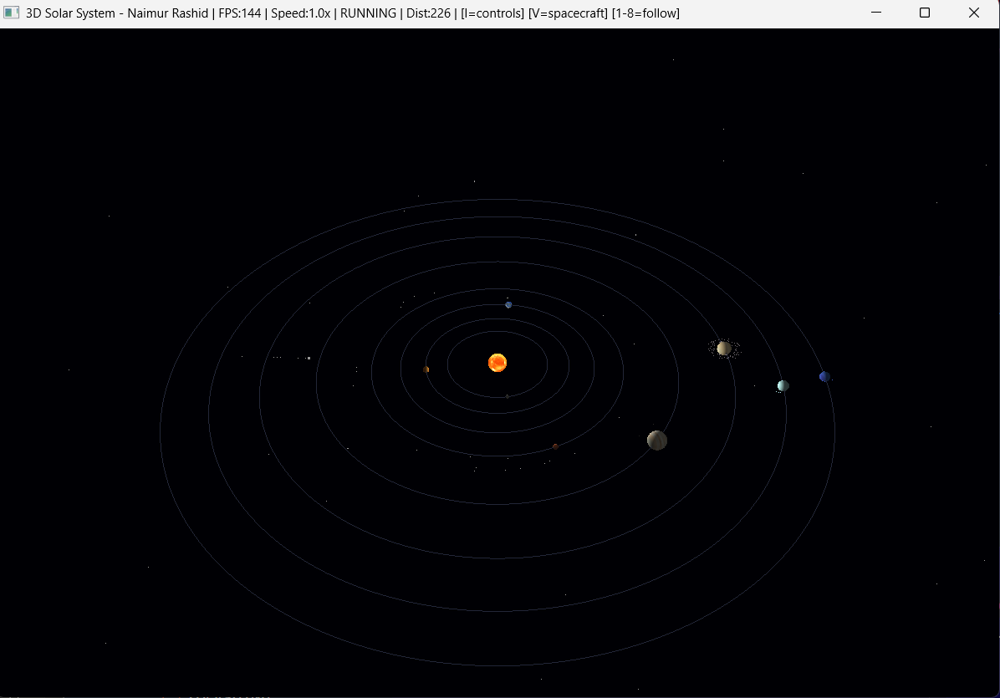
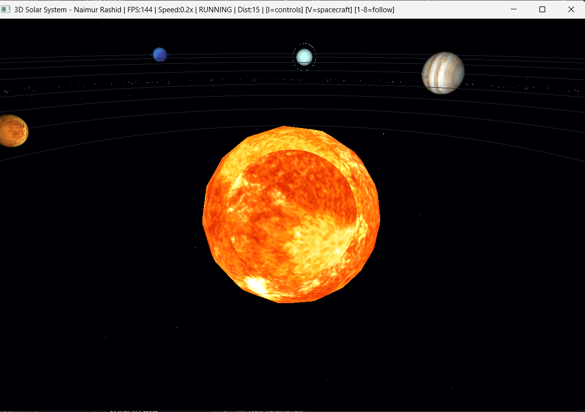
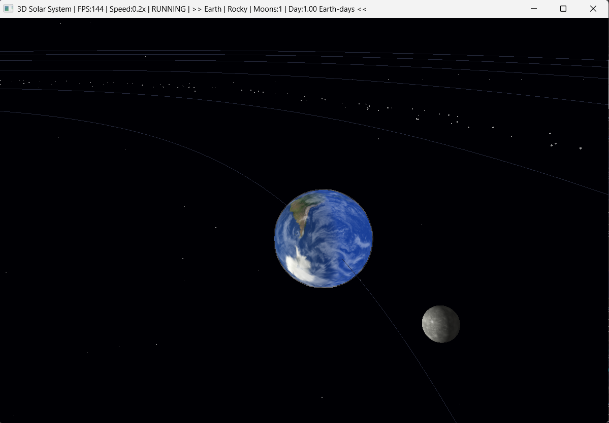
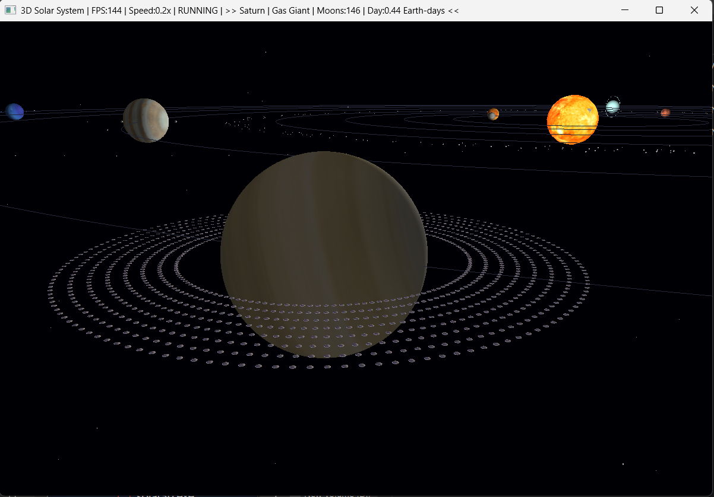
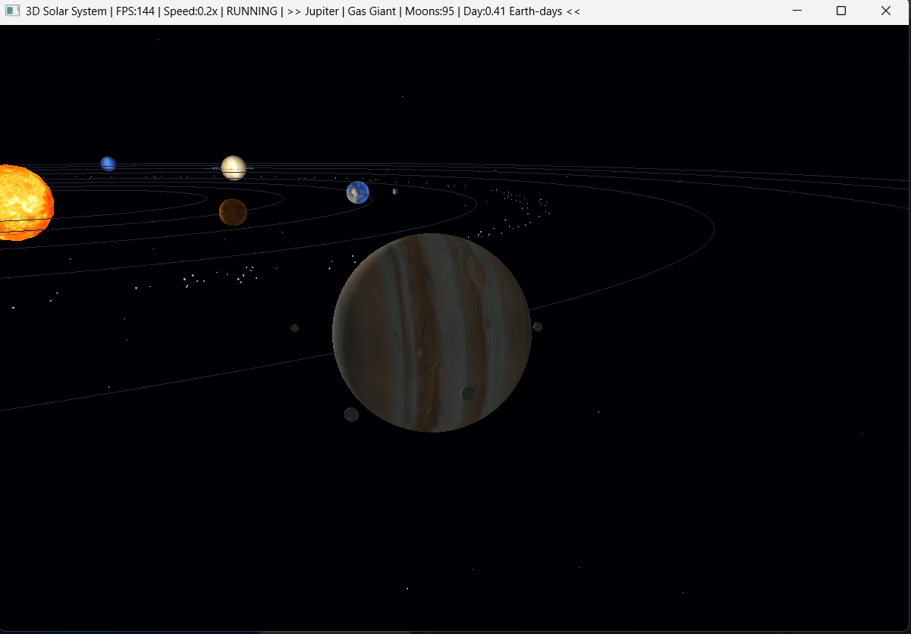
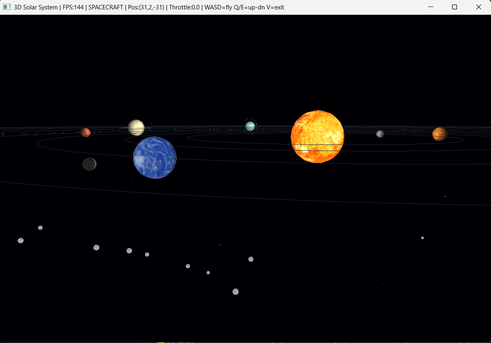
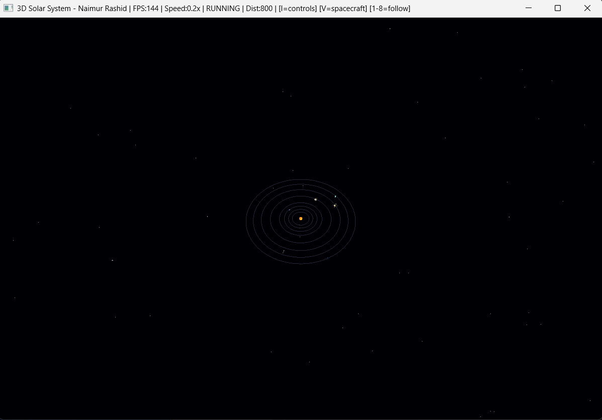

<div align="center">


<br/><br/>

```
  ██████╗ ██████╗      ███████╗ ██████╗ ██╗      █████╗ ██████╗
  ╚════██╗██╔══██╗     ██╔════╝██╔═══██╗██║     ██╔══██╗██╔══██╗
   █████╔╝██║  ██║     ███████╗██║   ██║██║     ███████║██████╔╝
  ╚═══██╗ ██║  ██║     ╚════██║██║   ██║██║     ██╔══██║██╔══██╗
  ██████╔╝██████╔╝     ███████║╚██████╔╝███████╗██║  ██║██║  ██║
  ╚═════╝ ╚═════╝      ╚══════╝ ╚═════╝ ╚══════╝╚═╝  ╚═╝╚═╝  ╚═╝

         ███████╗██╗   ██╗███████╗████████╗███████╗███╗   ███╗
         ██╔════╝╚██╗ ██╔╝██╔════╝╚══██╔══╝██╔════╝████╗ ████║
         ███████╗ ╚████╔╝ ███████╗   ██║   █████╗  ██╔████╔██║
         ╚════██║  ╚██╔╝  ╚════██║   ██║   ██╔══╝  ██║╚██╔╝██║
         ███████║   ██║   ███████║   ██║   ███████╗██║ ╚═╝ ██║
         ╚══════╝   ╚═╝   ╚══════╝   ╚═╝   ╚══════╝╚═╝     ╚═╝
```

# 🌌 3D Solar System Simulation

### *Real-Time Interactive 3D Solar System — Built with OpenGL 3.3 Core Profile*

<br/>

> A fully interactive 3D solar system simulation built from scratch using **Modern OpenGL**, **GLFW**, and **GLAD** with no game engine or external math library. Features real planet textures, Phong lighting, Kepler orbital mechanics, spacecraft mode, LOD rendering, and much more.

<br/>

[](https://github.com/naimurhamim)
[](#)
[](#)
[](#)

</div>
---

## 🎬Video
[](https://youtu.be/jE56us9O6x0)

---

---

## 📸 Screenshots

---

### 🌍 1. Full Solar System View



> The complete solar system viewed from above. All 8 planets orbit the Sun with accurate relative speeds based on **Kepler's Third Law** — Mercury moves fastest, Neptune slowest. Dotted orbit rings, asteroid belt between Mars and Jupiter, and an animated comet with a glowing tail are all visible.

---

### ☀️ 2. Sun Close-Up



> The Sun features a pulsing glow effect with multiple alpha-blended layers that expand and contract in real time. The surface uses a high-resolution texture with warm orange-yellow tones.

---

### 🌍 3. Earth & Moon



> Following Earth (press `3`) reveals the cloud layer rotating independently at 70% of Earth's self-rotation speed. The Moon orbits in real time. **Phong lighting** from the Sun creates a realistic day/night terminator. An atmospheric rim glow gives Earth its characteristic blue haze.

---

### 🪐 4. Saturn & Rings



> Saturn's ring system features a **gradient effect** — inner B-ring is brighter and warmer, the Cassini Division appears darker, and the outer A-ring is dimmer.

---

### 🔴 5. Jupiter & Galilean Moons



> Jupiter's four **Galilean moons** — Io, Europa, Ganymede, and Callisto — orbit at different distances and speeds, each with a unique orbital period.

---

### 🚀 6. Spacecraft Mode



> Press `V` to enter **Spacecraft Mode** — freely fly through the solar system using WASD controls. Mouse drag steers, scroll wheel controls throttle, Q/E moves up and down. The title bar shows real-time position and throttle value.

---

### 🌌 7. Deep Space View



> Scroll out far enough and the entire solar system fits in view — planets shrink to tiny colored dots and the Sun becomes a small bright point. Stars span a 2000-unit radius field. The **dynamic near/far plane** ensures no clipping at any zoom level.

---

## ✨ Features

| Feature | Description |
|---|---|
| 🪐 **8 Planets** | Mercury through Neptune with real NASA textures |
| ☀️ **Sun Glow** | Pulsing multi-layer alpha-blended glow animation |
| 💡 **Phong Lighting** | Per-fragment diffuse + ambient lighting from the Sun |
| 🌍 **Earth Atmosphere** | Blue rim glow shader effect on Earth's edge |
| ☁️ **Cloud Layer** | Separate cloud sphere rotating independently on Earth |
| 🪐 **Saturn Ring Gradient** | Multi-ring system with inner-to-outer brightness falloff |
| 🔵 **Uranus & Neptune Rings** | Tilted ring for Uranus, thin ring for Neptune |
| 🌕 **Moons** | Earth (1), Mars (Phobos + Deimos), Jupiter (4 Galilean moons) |
| ☄️ **Animated Comet** | Elliptical orbit with sun-facing tail and orbit path |
| 🪨 **Asteroid Belt** | 400 randomized asteroids with brown/grey color variation |
| 📐 **Kepler Orbit Speed** | Planets closer to Sun orbit faster — sqrt(r₀/r) scaling |
| 🎯 **Planet Follow Camera** | Smooth lerp-based camera that follows any planet |
| 🚀 **Spacecraft Mode** | WASD + mouse free-flight through the solar system |
| 🔍 **Exponential Zoom** | Fast zoom when far, precise zoom when close |
| 📊 **LOD Rendering** | 3 sphere detail levels (64/32/16 segments) by distance |
| ⏱️ **Delta Time** | Frame-rate independent animation on any hardware |
| 🖥️ **Planet Info Panel** | Title bar shows planet name, type, moon count, day length |
| 🌟 **800 Stars** | Randomized star field spread across 2000 units |

---

## 🎮 Controls

| Key / Input | Action |
|---|---|
| `Mouse Drag` | Rotate camera |
| `Scroll Wheel` | Zoom in/out (exponential) |
| `1` – `8` | Follow Mercury → Neptune |
| `0` / `F` | Free camera (center on Sun) |
| `P` | Pause simulation |
| `R` | Resume simulation |
| `=` | Increase speed |
| `-` | Decrease speed |
| `V` | Toggle spacecraft mode |
| `W A S D` | Fly forward/back/left/right (spacecraft) |
| `Q` / `E` | Fly up / down (spacecraft) |
| `Scroll` | Throttle control (spacecraft) |
| `I` | Print controls to console |
| `ESC` | Exit |

---

## 🧮 Mathematical Concepts

### Circular Orbit

$$x = r \cos(\theta), \quad z = r \sin(\theta)$$

Where `r` is the orbit radius and `θ` is incremented each frame by delta time.

### Kepler's Third Law (Speed Scaling)

$$v \propto \frac{1}{\sqrt{r}}$$

```cpp
float keplerSpeed(float baseSpeed, float orbitRadius) {
    return baseSpeed * sqrtf(earthOrbit / orbitRadius);
}
```

### Phong Lighting

$$I = I_a \cdot k_a + I_d \cdot k_d \cdot \max(\hat{n} \cdot \hat{l},\ 0)$$

### Smooth Camera Follow (Lerp)

$$\text{pos} = \text{lerp}(\text{pos},\ \text{target},\ \alpha)$$

```cpp
float lerpSpeed = 1.0f - powf(0.92f, deltaTime * 60.0f);
smoothTargetX = lerp(smoothTargetX, targetX, lerpSpeed);
```

---

## 🛠️ Tech Stack

| Component | Technology |
|---|---|
| Language | C++ 17 |
| Graphics API | OpenGL 3.3 Core Profile |
| Window & Input | GLFW 3.4 |
| OpenGL Loader | GLAD |
| Texture Loading | stb_image.h (single header) |
| Shader Language | GLSL 330 |
| Compiler | MinGW-w64 GCC 13.3 |
| IDE | VS Code |

---

## 📁 Project Structure

```
3D-Solar-System/
│
├── src/
│   ├── main.cpp          # Main application, render loop, all logic
│   ├── glad.c            # OpenGL function loader
│   ├── Shader.h          # GLSL shader loader and uniform helper
│   ├── Sphere.h          # Procedural UV sphere generator (VAO/VBO/EBO)
│   └── OrbitRing.h       # GL_LINE_LOOP orbit ring renderer
│
├── shaders/
│   ├── planet.vert       # Vertex shader — MVP transform, normals
│   ├── planet.frag       # Fragment shader — Phong, atmosphere, clouds
│   ├── line.vert         # Orbit ring vertex shader
│   └── line.frag         # Orbit ring fragment shader
│
├── textures/
│   ├── sun.jpg
│   ├── mercury.jpg
│   ├── venus.jpg
│   ├── earth.jpg
│   ├── earth_clouds.jpg
│   ├── mars.jpg
│   ├── jupiter.jpg
│   ├── saturn.jpg
│   ├── saturn_ring.png
│   ├── uranus.jpg
│   └── neptune.jpg
│
├── include/
│   ├── GLFW/             # GLFW headers
│   ├── glad/             # GLAD headers
│   ├── KHR/              # Khronos platform headers
│   └── stb_image.h       # Single-header image loader
│
├── lib/
│   └── libglfw3.a        # GLFW static library (MinGW)
│
├── screenshots/
├── .vscode/
│   └── tasks.json        # VS Code build task
├── README.md
└── .gitignore
```

---

## 🚀 Getting Started

### Prerequisites

- Windows 10/11
- [MinGW-w64](https://winlibs.com/) — GCC 13.x, POSIX, UCRT, x86_64
- VS Code or any C++ IDE

### 1. Clone the Repository

```bash
git clone https://github.com/naimurhamim/OpenGL-3D-Solar-System.git
cd OpenGL-3D-Solar-System
```

### 2. Download Textures

Get free 2K planet textures from [Solar System Scope](https://www.solarsystemscope.com/textures/) and place them in the `textures/` folder with the exact filenames shown in the project structure above.

### 3. Build

**VS Code:**
```
Ctrl + Shift + B
```

**Manual:**
```bash
g++ -o solar3d.exe src/main.cpp src/glad.c -I include -L lib -lglfw3 -lopengl32 -lgdi32 -std=c++17
```

### 4. Run

```bash
./solar3d.exe
```

---

## 🔧 Function Reference

| Function | Description |
|---|---|
| `main()` | Init GLFW/GLAD, load textures, run render loop |
| `drawStars()` | Renders 800 randomized stars across 2000 unit field |
| `drawAsteroidBelt()` | Renders 400 asteroids with randomized grey/brown color |
| `drawComet()` | Animated comet with orbit path and sun-facing tail |
| `drawLOD()` | Selects sphere detail level based on camera distance |
| `keplerSpeed()` | Returns orbital speed using Kepler's Third Law |
| `lerp()` | Linear interpolation for smooth camera transitions |
| `lookAt()` | Custom view matrix — no external math library |
| `perspective()` | Custom projection matrix |
| `loadTexture()` | Loads JPG/PNG textures via stb_image |
| `Shader` class | Compiles/links GLSL shaders, sets all uniform types |
| `Sphere` class | Generates UV sphere with positions, UVs, and normals |
| `OrbitRing` class | Smooth orbit circle using GL_LINE_LOOP |
| `mouseButtonCB()` | GLFW mouse button event handler |
| `cursorPosCB()` | Camera rotation or spacecraft steering |
| `scrollCB()` | Exponential zoom or spacecraft throttle |
| `keyCB()` | Planet follow, speed, pause, spacecraft toggle |

---

## 🪐 Planet Data

| Planet | Orbit Radius | Size | Moons | Type | Day Length |
|---|---|---|---|---|---|
| Mercury | 14 | 0.5 | 0 | Rocky | 58.6 Earth-days |
| Venus | 20 | 0.9 | 0 | Rocky | 243.0 Earth-days |
| Earth | 27 | 1.0 | 1 | Rocky | 1.0 Earth-day |
| Mars | 35 | 0.7 | 2 | Rocky | 1.03 Earth-days |
| Jupiter | 50 | 2.5 | 95 | Gas Giant | 0.41 Earth-days |
| Saturn | 65 | 2.0 | 146 | Gas Giant | 0.44 Earth-days |
| Uranus | 78 | 1.5 | 28 | Ice Giant | 0.72 Earth-days |
| Neptune | 90 | 1.4 | 16 | Ice Giant | 0.67 Earth-days |

---

## 🔮 Future Improvements

- [ ] FreeType font rendering for on-screen planet labels
- [ ] Skybox using NASA star map texture
- [ ] Planet normal maps for surface relief detail
- [ ] Realistic spacecraft 3D model via `.obj` loader
- [ ] Click-to-select planet with mouse ray casting
- [ ] Sound effects using OpenAL

---

## 📄 License

Licensed under the **MIT License** — see [LICENSE](LICENSE) for details.

---

<div align="center">

## 👨‍💻 Author

**MD Naimur Rashid**

[](https://github.com/naimurhamim)

---

*Built from scratch with no game engine — pure OpenGL, pure C++*

⭐ **If you found this project helpful, please give it a star!** ⭐

</div>
